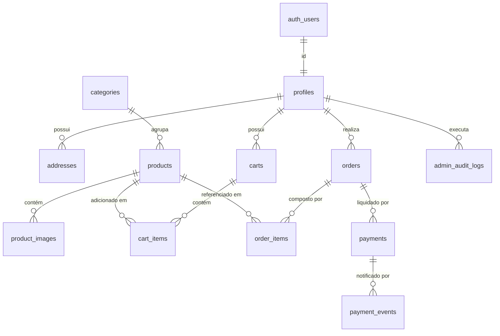

# MODELO DE DADOS E BANCO — ISIS STORE

> **Documento:** `docs/DATABASE.md`  
> **Fase:** 03 — Supabase + Banco + RLS  
> **Data:** 2026-09-26  
> **Status:** Ativo e aplicado no Supabase (Projeto: `wjhmukemyvimgxapscao` / Região: `sa-east-1` São Paulo)  
> **Motor:** PostgreSQL 17 via Supabase

---

## 1. Visão Geral da Arquitetura de Dados

O banco de dados do **Isis Store** foi projetado seguindo rigorosamente as diretrizes de segurança, integridade financeira e prevenção contra falhas de concorrência.

### Princípios Imutáveis:
1. **Dinheiro em Centavos:** Valores monetários (`price_cents`, `subtotal_cents`, `total_cents`, `amount_cents`) são armazenados exclusivamente como inteiros (`INTEGER >= 0`), evitando erros de arredondamento inerentes a ponto flutuante (`float`).
2. **Snapshot Imutável em Pedidos:** A tabela `order_items` preserva o nome do produto, SKU e preço unitário no momento exato da compra. Alterações posteriores no catálogo nunca distorcem pedidos passados.
3. **Proteção Anti-Estoque Negativo:** A coluna `stock` possui constraint explícita `CHECK (stock >= 0)`.
4. **Row Level Security (RLS) Ativo em 100% das Tabelas:** Nenhuma tabela do schema `public` opera sem RLS habilitado.
5. **Idempotência Financeira:** Webhooks de gateways são validados e registrados na tabela `payment_events` com chave única `event_id`.

---

## 2. Diagrama Entidade-Relacionamento (ERD)

---

## 3. Catálogo de Tabelas

### 3.1 `profiles`
Espelho do usuário de `auth.users`, estendido com dados específicos do e-commerce.
* `id` (UUID, PK, FK `auth.users.id` ON DELETE CASCADE)
* `full_name` (TEXT)
* `email` (TEXT)
* `phone` (TEXT)
* `cpf` (TEXT)
* `role` (ENUM: `customer`, `admin`)
* `avatar_url` (TEXT)
* `created_at`, `updated_at` (TIMESTAMPTZ)

### 3.2 `addresses`
Endereços de entrega vinculados ao perfil do cliente.
* `id` (UUID, PK)
* `profile_id` (UUID, FK `profiles.id`)
* `recipient_name`, `street`, `number`, `complement`, `neighborhood`, `city`, `state`, `postal_code` (TEXT)
* `is_default` (BOOLEAN)

### 3.3 `categories`
Categorias do catálogo oficial da marca.
* `id` (UUID, PK)
* `name` (TEXT)
* `slug` (TEXT, UNIQUE)
* `description` (TEXT)
* `icon_name` (TEXT)
* `sort_order` (INTEGER)
* `is_active` (BOOLEAN)

**Categorias Oficiais Inicializadas:**
1. `Personalizados` (slug: `personalizados`)
2. `Infantil / Baby` (slug: `infantil-baby`)
3. `Masculino / Feminino` (slug: `masculino-feminino`)
4. `Casa / Eletrônicos` (slug: `casa-eletronicos`)
5. `Acessórios` (slug: `acessorios`)

### 3.4 `products`
Catálogo de produtos da Isis Store.
* `id` (UUID, PK)
* `name`, `slug` (TEXT, UNIQUE), `sku` (TEXT, UNIQUE)
* `description`, `short_description` (TEXT)
* `category_id` (UUID, FK `categories.id` ON DELETE SET NULL)
* `price_cents` (INTEGER >= 0)
* `sale_price_cents` (INTEGER >= 0)
* `stock` (INTEGER >= 0)
* `status` (ENUM: `draft`, `published`, `archived`)
* `featured` (BOOLEAN)
* `weight_grams` (INTEGER)

### 3.5 `product_images`
Imagens associadas aos produtos armazenadas no Supabase Storage.
* `id` (UUID, PK)
* `product_id` (UUID, FK `products.id` ON DELETE CASCADE)
* `storage_path` (TEXT)
* `public_url` (TEXT)
* `alt_text` (TEXT)
* `width`, `height`, `sort_order` (INTEGER)
* `is_primary` (BOOLEAN)

### 3.6 `carts` e `cart_items`
Carrinho de compras persistido.
* `carts.profile_id` (UUID, FK `profiles.id` para usuários autenticados)
* `carts.session_id` (TEXT para visitantes anônimos)
* `cart_items`: `quantity > 0`, constraint única `(cart_id, product_id)`.

### 3.7 `orders` e `order_items`
Gestão de pedidos de venda com histórico imutável.
* `order_number` (TEXT, UNIQUE, ex: `IS-54872`)
* `status` (ENUM: `pending_payment`, `paid`, `processing`, `shipped`, `delivered`, `cancelled`, `refunded`)
* `subtotal_cents`, `shipping_cents`, `discount_cents`, `total_cents` (INTEGER >= 0)
* `shipping_address` (JSONB com endereço imutável)
* `order_items`: snapshot de `product_name`, `sku`, `unit_price_cents`, `quantity`, `subtotal_cents`.

### 3.8 `payments` e `payment_events` (Idempotência)
* `payments`: status de pagamento desacoplado do status do pedido (`pending`, `approved`, `rejected`, etc.).
* `payment_events`: armazena `event_id` único recebido do webhook do Mercado Pago. Caso o gateway reenvie a notificação, a consulta verifica o `event_id` e evita processamento duplicado.

### 3.9 `payment_gateways` e `admin_audit_logs`
* `payment_gateways`: configuração dinâmica de provedores de pagamento.
* `admin_audit_logs`: rastreamento auditável de ações administrativas (`actor_id`, `action`, `entity`, `entity_id`, `metadata`).

---

## 4. Políticas de Row Level Security (RLS)

| Tabela | Anônimo / Visitante | Cliente Autenticado | Administrador |
| :--- | :--- | :--- | :--- |
| `profiles` | Bloqueado | SELECT / UPDATE próprio perfil | SELECT / UPDATE completo |
| `addresses` | Bloqueado | ALL próprios endereços | ALL completo |
| `categories` | SELECT (ativas) | SELECT (ativas) | ALL completo |
| `products` | SELECT (publicados) | SELECT (publicados) | ALL completo |
| `product_images`| SELECT | SELECT | ALL completo |
| `carts` | SELECT próprio session | ALL próprio carrinho | ALL completo |
| `cart_items` | ALL próprio carrinho | ALL próprio carrinho | ALL completo |
| `orders` | Bloqueado | SELECT próprios pedidos | ALL completo |
| `order_items` | Bloqueado | SELECT itens próprios pedidos | ALL completo |
| `payments` | Bloqueado | SELECT próprios pagamentos | ALL completo |
| `payment_events`| Bloqueado | Bloqueado | ALL completo (Admin / Webhook) |
| `admin_audit_logs` | Bloqueado | Bloqueado | ALL completo |

---

## 5. Storage Buckets

* **Bucket:** `products` (Público)
  * **Leitura:** Livre para exibição de imagens no storefront.
  * **Upload / Delete:** Restrito a usuários com `role = 'admin'` através da função `public.is_admin()`.

---

## 6. Verificação e Gates da Fase 03

* **Migrations Aplicadas:** Sim (`20260927000000_initial_schema.sql` via Supabase MCP).
* **RLS 100% Ativo:** Sim, verificado via `list_tables` (11 tabelas públicas com RLS ativo).
* **Tipos TypeScript:** Gerados automaticamente e salvos em `src/types/database.ts`.
* **Clientes Supabase:** `src/lib/supabase/client.ts`, `src/lib/supabase/server.ts` e `src/lib/supabase/admin.ts`.
